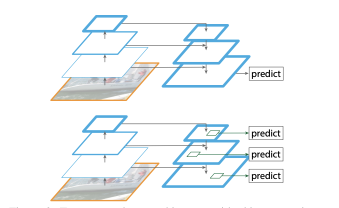

# Feature Pyramid Networks for object Detection
> T.y lin P.Dollar R.Girshick 
> 
>Computational issue를 해결하면서 multi-scale base object detection task 수행
> 

## Goal
> 다양한 scale에서 sementic 하게 feature를 추출하는 것을 목표로 함

`The goal of this paper is to naturally leverage the pyramidal shape of a ConvNet’s feature hierarchy while creating a feature pyramid that has strong semantics at all
scales. To achieve this goal, we rely on an architecture that
combines low-resolution, semantically strong features with
high-resolution, semantically weak features via a top-down
pathway and lateral connections` 

## Method

> 주 메서드는 top-down 아키텍처에 lateral connection

주로 피라미드 구조에서는 low-resolution image, 즉 상위에 위치할 수록 의미 벡터를 압축한 feture map 을 얻습니다. 
하지만 sementic 한 위치 정보는 피라미드의 아래, high-resolution에서 더 잘 나타납니다.
해당 메서드는 피라미드의 3개의 feature map을 함께 사용해서  위치정보와 의미 정보를 연결하여 image에 대한 feture를 압축하고, 더 잘 풀어내는 데 집중합니다.

### lateral connection

아키텍처 Input == 다시 리뷰`

사이즈가 다른 두 개의 feature map을 연산하기 위해서는 상위 layer를 upsampling해야 합니다.
따라서 해당 논문에서는 C5 * upsample conv *2 + C4 * conv *1 연산을 진행합니다. 

