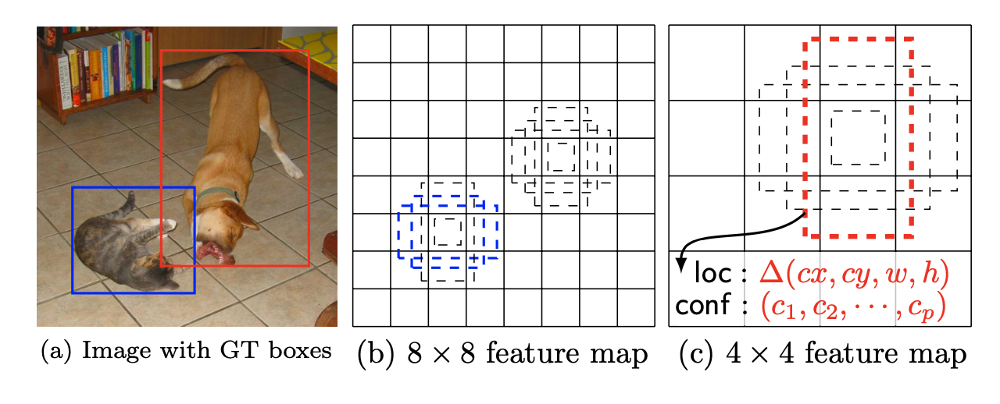
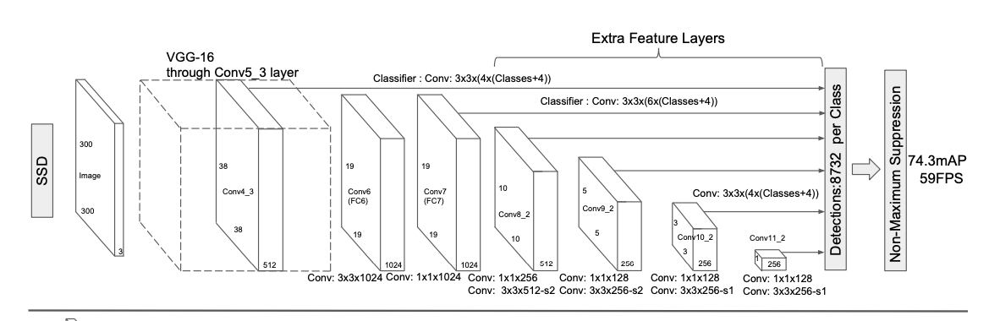

# SSD

Created: March 17, 2022 12:49 PM
Last Edited Time: March 17, 2022 3:10 PM
Type: Review

<aside>
💡 one-stage-detection 논문 W.Liu et al 2016

</aside>

## 1. **Intro : 이미지 내에서 오브젝트르 어떻게 찾아 내는지**
- 기존의 방식은 1) bounding box 를 가정, 2) 각 box 를 위한 픽셀 혹은 피처를 resample, 3) 높은 성능을 보이는 분류기 사용
- SSD는 여러 사이즈의 fillter를 각 feature map 에 사용하면서 localizaion 과 classfication 을 수행
- category socres (분류 ), box offsets (오브젝트 위치)

## 2.  **Method : Single Shot Detector**

- 각 오브젝트에 대해 다양한 사이즈의 default box를 평가
- 각 box 마다 shape offsets , confidences 를 평가, loss 는 두 텀의 가중치 합

`feed-forard convoltional network that produces a fixed-size collection of bounding boxes and scores for presence of object class`

2-1) 아키텍처는

VGG 16 (classfication head 제외) : base network + detection network

2-2) Multi-scale feature maps for detection 

candidate of bounding box 없이 오브젝트를 어떻게 찾을 것인지 → 마지막 conv layer 에서 다양한 scale의 map layer를 사용하겠다

> 각 layer stage 마다 분류기를 적용 → 마지막 분류기에서 오브젝트의 위치를 판단하겠다
conv layer로 latent space 를 풀어가는 과정에서 분류기를 위한 conv layer 적용
> 

- 별도로 분류기 구성

> style gan 에서 사용하는 feature map과 차이가 있음
> 

> 각 layer에 적용된 분류 layer가 다음 layer에 영향을 주지 않는다는 점
> 

2-3) Convoulutional predictors for detection

각 layer에 conv3x3을 적용

> 의문점 layer사이즈가 다른데 어떻게 mapping 을 했는지
> 

**2-4) Default boxes and aspect ratios** 

box를 default로 고정시킴 → default box의 위치가 각 픽셀  안에서 고정

## 3. **Training**

> ground truth information needs to be assigned to specific outputs in the fixed set of detector outptus
> 

- 먼저 ground truth info를 바탕으로 default box를 선택, fix 시킨 뒤, classfifation 진행

- multi box 와 다른 점은 default box를 선택할 때 maximum 값으로 최적화 시키지 않고 일정 쓰레스 홀드 이상인 것을 채택

3-1) Matching default boxes - ground truth info

- jaccard overlap 사용(as in Multibox) , threshold (0.5)

3-2) Traing objective: 

loss func : 

$L(x,c,l,g) = 1/N (L_c(x,c) + aL_l(x,l,g))$

3-3) Choosing scales and aspect rations for default boxes : 다양한 object size를 잡기 위해서 고안

- high feature map + global context pooling ⇒ segmetatnion 성능 향상

- 각 layer를 분류기에 통과시킨 output을 사용하기 때문에 layer와 box의 shape 를 고려하지 않음

$$
s_k = smin + (smax - smin)/m-1 (k-1)
$$

`By combining predictions for all default boxes with different scales and aspect ratios from all locations of many feature maps, we have a diverse set of predictions, covering various input object sizes and shapes. For example, in Fig. 1, the dog is matched to a default box in the 4 × 4 feature map, but not to any default boxes in the 8 × 8 feature map. This is because those boxes have different scales and do not match the dog box, and therefore are considered as negatives during training.`

3-4) Hard negative minng

negative box 도 sampling 하여 사용 

default box가 많아지면 다시 말하면 detection object가 많아지면 학습시킬 negative box도 많아지는데 

이 때 class 간 inbalance 문제가 있음, 따라서 negative box 중 conf loss가 큰 것만 사용

> negative 학습이 있는 이유 → 각 class 간의 차이가 커지도록 학습
>