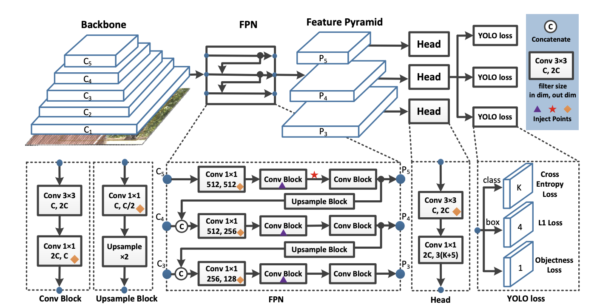

# Review:  PP-YOLO: An Effective and Efficient Implementation of Object Detector

> yolov3 base model에서 속도와 성능 개선 작업
> 
## detection stage

### 1. Backbone

다양한 스케일 변화를 반영하여 feature extraction 
해당 논문에서는 Yolov3 에서 사용하는 아키텍처를 사용하되 base conv block 을 darknet 에서 resnet50으로 교체,
resnet 의 마지막 conv3x3 layer만 수정

### 2. Neck
FPN 사용
C3, P3 :low-level feature이지만 객체에 대한 위치 정보를 더 잘 반영

### 3. Head
Yolov3 의 head 사용, conv3x3 , conv1x1 로 downsampling
output class = 3 ( K+5), 3은 사용한 feature map, K 는 class, 5개 중 4개의 채널은 bounding box 추정
마지막 class obj score(배경 구분)

## selection trick

해당 논문에서 사용한 주요 트릭

## experiment

backbone망의 arc를 resnet 으로 바꾸었을 때 computational fee 와 정확도가 가장 좋았음

